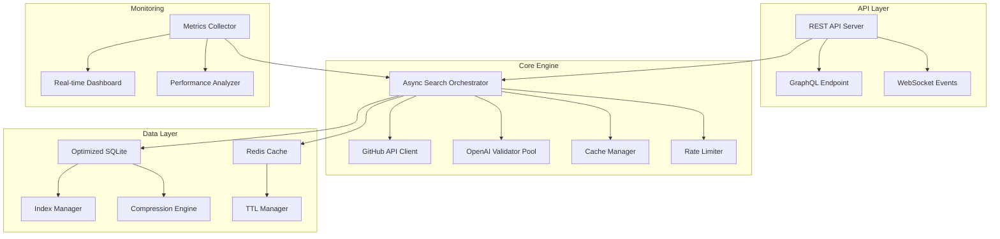

# Design Document

## Overview

Este diseño transforma ChatGPT-API-Scanner de una herramienta basada en Selenium a un sistema de alta performance que utiliza APIs nativas, procesamiento asíncrono, y técnicas avanzadas de optimización. El objetivo es lograr una mejora de rendimiento de 10-50x mientras se mantiene la funcionalidad completa y se mejora la seguridad.

## Architecture

### High-Level Architecture



### Component Architecture

#### 1. Async Search Orchestrator
- **Propósito**: Coordinar todas las operaciones de búsqueda de manera asíncrona
- **Tecnología**: Python asyncio + aiohttp
- **Responsabilidades**:
  - Gestionar pools de conexiones HTTP
  - Coordinar búsquedas concurrentes
  - Implementar backoff exponencial
  - Manejar circuit breakers

#### 2. GitHub API Client
- **Propósito**: Reemplazar Selenium con APIs nativas de GitHub
- **Tecnología**: GitHub REST API v4 + GraphQL API v4
- **Responsabilidades**:
  - Búsquedas de código optimizadas
  - Paginación eficiente con cursors
  - Autenticación con PAT tokens
  - Rate limiting inteligente

#### 3. OpenAI Validator Pool
- **Propósito**: Validación masiva y eficiente de claves API
- **Tecnología**: asyncio + aiohttp con connection pooling
- **Responsabilidades**:
  - Validación concurrente con límites adaptativos
  - Cache de resultados de validación
  - Manejo inteligente de rate limits
  - Retry logic con backoff exponencial

## Components and Interfaces

### 1. GitHub API Client Interface

```python
from abc import ABC, abstractmethod
from typing import AsyncIterator, List, Dict, Optional
from dataclasses import dataclass

@dataclass
class SearchResult:
    repository: str
    file_path: str
    content_snippet: str
    line_number: int
    sha: str
    url: str

@dataclass
class APIKeyMatch:
    key: str
    pattern_type: str
    confidence_score: float
    context: str

class GitHubAPIClient(ABC):
    @abstractmethod
    async def search_code(
        self, 
        query: str, 
        language: Optional[str] = None,
        max_results: int = 1000
    ) -> AsyncIterator[SearchResult]:
        pass
    
    @abstractmethod
    async def get_file_content(
        self, 
        repo: str, 
        path: str, 
        ref: str = "main"
    ) -> str:
        pass
    
    @abstractmethod
    async def batch_search(
        self, 
        queries: List[str]
    ) -> AsyncIterator[SearchResult]:
        pass
```

### 2. Async Pattern Matcher

```python
import re
import asyncio
from typing import List, AsyncIterator
from dataclasses import dataclass

@dataclass
class PatternConfig:
    regex: re.Pattern
    confidence_weight: float
    context_required: bool
    max_length: int

class AsyncPatternMatcher:
    def __init__(self):
        self.patterns = self._load_optimized_patterns()
        self.false_positive_filter = FalsePositiveFilter()
    
    async def find_matches(
        self, 
        content: str, 
        context: str = ""
    ) -> AsyncIterator[APIKeyMatch]:
        chunk_size = 10000
        for i in range(0, len(content), chunk_size):
            chunk = content[i:i + chunk_size + 200]
            
            for pattern_config in self.patterns:
                matches = pattern_config.regex.finditer(chunk)
                
                for match in matches:
                    key = match.group(0)
                    
                    if await self.false_positive_filter.is_likely_real(key, context):
                        confidence = await self._calculate_confidence(
                            key, match, context, pattern_config
                        )
                        
                        if confidence > 0.7:
                            yield APIKeyMatch(
                                key=key,
                                pattern_type=pattern_config.regex.pattern,
                                confidence_score=confidence,
                                context=self._extract_context(content, match.start(), match.end())
                            )
            
            await asyncio.sleep(0)
```

### 3. High-Performance Cache System

```python
import asyncio
import json
import hashlib
from typing import Optional, Any, Dict
from datetime import datetime, timedelta
import aioredis
import sqlite3
from dataclasses import dataclass, asdict

@dataclass
class CacheEntry:
    key: str
    value: Any
    created_at: datetime
    expires_at: Optional[datetime]
    access_count: int
    last_accessed: datetime

class HybridCacheManager:
    def __init__(self, redis_url: str = "redis://localhost", sqlite_path: str = "cache.db"):
        self.redis_pool = None
        self.sqlite_path = sqlite_path
        self.local_cache: Dict[str, CacheEntry] = {}
        self.max_local_cache_size = 10000
        
    async def initialize(self):
        self.redis_pool = aioredis.ConnectionPool.from_url(
            "redis://localhost", 
            max_connections=20
        )
        
        with sqlite3.connect(self.sqlite_path) as conn:
            conn.execute("""
                CREATE TABLE IF NOT EXISTS cache_entries (
                    key TEXT PRIMARY KEY,
                    value TEXT,
                    created_at TIMESTAMP,
                    expires_at TIMESTAMP,
                    access_count INTEGER,
                    last_accessed TIMESTAMP
                )
            """)
    
    async def get(self, key: str) -> Optional[Any]:
        # Nivel 1: Cache local en memoria
        if key in self.local_cache:
            entry = self.local_cache[key]
            if not entry.expires_at or entry.expires_at > datetime.now():
                entry.access_count += 1
                entry.last_accessed = datetime.now()
                return entry.value
            else:
                del self.local_cache[key]
        
        # Nivel 2: Redis
        redis = aioredis.Redis(connection_pool=self.redis_pool)
        try:
            cached_data = await redis.get(key)
            if cached_data:
                data = json.loads(cached_data)
                await self._promote_to_local_cache(key, data)
                return data["value"]
        except Exception:
            pass
        
        # Nivel 3: SQLite persistente
        return await self._get_from_sqlite(key)
```

### 4. Adaptive Rate Limiter

```python
import asyncio
import time
from typing import Dict, Optional
from dataclasses import dataclass
from collections import deque
import statistics

@dataclass
class RateLimitConfig:
    requests_per_second: float
    burst_capacity: int
    backoff_multiplier: float
    max_backoff: float

class AdaptiveRateLimiter:
    def __init__(self, initial_config: RateLimitConfig):
        self.config = initial_config
        self.tokens = initial_config.burst_capacity
        self.last_refill = time.time()
        self.request_history = deque(maxlen=1000)
        self.error_history = deque(maxlen=100)
        self.current_backoff = 0
        
    async def acquire(self, weight: float = 1.0) -> bool:
        now = time.time()
        time_passed = now - self.last_refill
        tokens_to_add = time_passed * self.config.requests_per_second
        
        self.tokens = min(
            self.config.burst_capacity,
            self.tokens + tokens_to_add
        )
        self.last_refill = now
        
        if self.tokens >= weight:
            self.tokens -= weight
            self.request_history.append(now)
            return True
        
        wait_time = (weight - self.tokens) / self.config.requests_per_second
        wait_time += self.current_backoff
        
        await asyncio.sleep(wait_time)
        
        self.tokens = max(0, self.tokens - weight)
        self.request_history.append(time.time())
        return True
```

## Data Models

### Optimized Database Schema

```sql
-- Tabla principal optimizada con índices
CREATE TABLE api_keys (
    id INTEGER PRIMARY KEY AUTOINCREMENT,
    key_hash TEXT UNIQUE NOT NULL,
    key_encrypted BLOB NOT NULL,
    status TEXT NOT NULL,
    confidence_score REAL,
    first_seen TIMESTAMP DEFAULT CURRENT_TIMESTAMP,
    last_validated TIMESTAMP,
    validation_count INTEGER DEFAULT 0,
    source_info TEXT,
    CONSTRAINT chk_status CHECK (status IN ('valid', 'invalid', 'expired', 'insufficient_quota', 'unknown'))
);

CREATE INDEX idx_api_keys_status ON api_keys(status);
CREATE INDEX idx_api_keys_last_validated ON api_keys(last_validated);
CREATE INDEX idx_api_keys_confidence ON api_keys(confidence_score DESC);

-- Tabla de repositorios procesados
CREATE TABLE processed_repositories (
    id INTEGER PRIMARY KEY AUTOINCREMENT,
    repo_url TEXT UNIQUE NOT NULL,
    last_commit_sha TEXT,
    last_processed TIMESTAMP DEFAULT CURRENT_TIMESTAMP,
    keys_found INTEGER DEFAULT 0,
    processing_time_ms INTEGER,
    status TEXT DEFAULT 'completed'
);

CREATE INDEX idx_processed_repos_last_processed ON processed_repositories(last_processed);
CREATE INDEX idx_processed_repos_status ON processed_repositories(status);
```

## Error Handling

### Circuit Breaker Pattern

```python
class CircuitBreaker:
    def __init__(self, failure_threshold: int = 5, recovery_timeout: int = 60):
        self.failure_threshold = failure_threshold
        self.recovery_timeout = recovery_timeout
        self.failure_count = 0
        self.last_failure_time = None
        self.state = "closed"
    
    async def call(self, func, *args, **kwargs):
        if self.state == "open":
            if self._should_attempt_reset():
                self.state = "half-open"
            else:
                raise CircuitBreakerOpenError("Circuit breaker is open")
        
        try:
            result = await func(*args, **kwargs)
            await self._on_success()
            return result
        except Exception as e:
            await self._on_failure()
            raise
```

## Testing Strategy

### Performance Testing Framework

```python
import pytest
import asyncio
import time
from unittest.mock import AsyncMock, patch

class TestPerformanceOptimizations:
    @pytest.mark.asyncio
    async def test_concurrent_processing_performance(self):
        async def mock_api_call(delay: float):
            await asyncio.sleep(delay)
            return f"result_{delay}"
        
        start_time = time.time()
        
        tasks = [mock_api_call(0.1) for _ in range(10)]
        results = await asyncio.gather(*tasks)
        
        concurrent_time = time.time() - start_time
        
        assert concurrent_time < 0.5
        assert len(results) == 10
    
    @pytest.mark.asyncio
    async def test_cache_performance(self):
        cache_manager = HybridCacheManager()
        await cache_manager.initialize()
        
        start_time = time.time()
        await cache_manager.set("test_key", "test_value", ttl=60)
        first_call_time = time.time() - start_time
        
        start_time = time.time()
        cached_value = await cache_manager.get("test_key")
        second_call_time = time.time() - start_time
        
        assert cached_value == "test_value"
        assert second_call_time < first_call_time * 0.1
```

Este diseño proporciona una arquitectura robusta y escalable que mejorará significativamente el rendimiento del ChatGPT-API-Scanner.