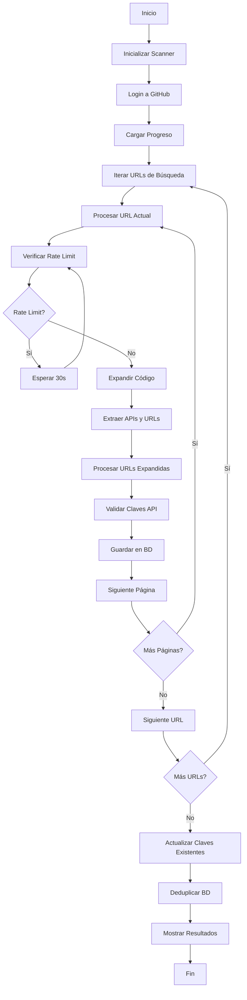

# Lógica del Código - ChatGPT-API-Scanner

## Descripción General

ChatGPT-API-Scanner es una herramienta de investigación de seguridad que automatiza la búsqueda de claves API de OpenAI expuestas en repositorios públicos de GitHub. El sistema utiliza Selenium WebDriver para navegar por GitHub, expresiones regulares para identificar patrones de claves API, y una base de datos SQLite para almacenar y gestionar los resultados.

## Arquitectura del Sistema

### Componentes Principales

1. **`main.py`** - Controlador principal y lógica de escaneo
2. **`manager.py`** - Gestión de datos, cookies y progreso
3. **`utils.py`** - Validación de claves API con OpenAI
4. **`configs.py`** - Configuraciones y patrones de búsqueda

### Flujo de Datos

```
GitHub Search → Selenium WebDriver → Regex Matching → API Validation → SQLite Storage
```

## Secuencia de Operación Detallada

### 1. Inicialización del Sistema

**Clase: `APIKeyLeakageScanner`**

```python
def __init__(self, db_file: str, keywords: list, languages: list):
```

**Proceso:**
1. **Configuración de Base de Datos**: Inicializa `DatabaseManager` con archivo SQLite
2. **Generación de URLs de Búsqueda**: Construye URLs de búsqueda de GitHub combinando:
   - Patrones regex de claves API (de `REGEX_LIST`)
   - Rutas de archivos específicas (de `PATHS`)
   - Lenguajes de programación (de `LANGUAGES`)
3. **Preparación de Consultas**: Crea lista `candidate_urls` con todas las combinaciones posibles

**Ejemplo de URL generada:**
```
https://github.com/search?q=(/sk-proj-[A-Za-z0-9-_]{74}T3BlbkFJ[A-Za-z0-9-_]{73}A/)+language:Python&type=code&ref=advsearch
```

### 2. Autenticación en GitHub

**Método: `login_to_github()`**

**Secuencia:**
1. **Inicialización del WebDriver**:
   ```python
   options = webdriver.ChromeOptions()
   options.add_argument("--ignore-certificate-errors")
   self.driver = webdriver.Chrome(options=options)
   ```

2. **Gestión de Cookies**:
   - Verifica existencia de `cookies.pkl`
   - Si no existe: solicita login manual y guarda cookies
   - Si existe: carga cookies automáticamente

3. **Verificación de Login**:
   - Navega a GitHub
   - Verifica ausencia de botón "Sign in"
   - Termina ejecución si no está autenticado

### 3. Proceso de Búsqueda Principal

**Método: `search(from_iter: int | None = None)`**

**Flujo de Control:**
```python
for idx, url in enumerate(self.candidate_urls):
    if idx < from_iter:  # Skip ya procesadas
        continue
    self._process_url(url)  # Procesar URL actual
    progress.save(idx, total)  # Guardar progreso
```

**Características:**
- **Recuperación de Progreso**: Puede continuar desde iteración específica
- **Persistencia**: Guarda progreso cada iteración
- **Barra de Progreso**: Usa `tqdm` para visualización

### 4. Procesamiento de URLs de Búsqueda

**Método: `_process_url(url: str)`**

**Algoritmo Principal:**

#### 4.1 Navegación y Control de Rate Limiting
```python
self.driver.get(url)
while True:  # Loop hasta procesar todas las páginas
    # Verificar rate limit de GitHub
    if self.driver.find_elements(by=By.XPATH, 
        value="//*[contains(text(), 'You have exceeded a secondary rate limit')]"):
        # Esperar 30 segundos con barra de progreso
        for _ in tqdm(range(30), desc="⏳ Rate limit reached, waiting ..."):
            time.sleep(1)
        self.driver.refresh()
        continue
```

#### 4.2 Expansión de Código
```python
def _expand_all_code(self):
    elements = self.driver.find_elements(by=By.XPATH, 
        value="//*[contains(text(), 'more match')]")
    for element in elements:
        element.click()  # Expandir código truncado
```

#### 4.3 Extracción de APIs y URLs
```python
def _find_urls_and_apis(self) -> tuple[list[str], list[str]]:
    apis_found = []
    urls_need_expand = []
    
    codes = self.driver.find_elements(by=By.CLASS_NAME, value="code-list")
    for element in codes:
        # Aplicar todos los regex patterns
        for regex, _, too_long in REGEX_LIST[2:]:
            if not too_long:
                apis.extend(regex.findall(element.text))
        
        if len(apis) == 0:
            # Necesita expansión completa del código
            a_tag = element.find_element(by=By.XPATH, value=".//a")
            urls_need_expand.append(a_tag.get_attribute("href"))
```

#### 4.4 Paginación
```python
try:
    next_buttons = self.driver.find_elements(by=By.XPATH, 
        value="//a[@aria-label='Next Page']")
    WebDriverWait(self.driver, 5).until(
        EC.presence_of_element_located((By.XPATH, "//a[@aria-label='Next Page']")))
    next_buttons[0].click()
except Exception:
    break  # No más páginas
```

#### 4.5 Procesamiento de URLs que Requieren Expansión
```python
for u in tqdm(urls_need_expand, desc="🔍 Expanding URLs ..."):
    # Verificar si ya fue procesada
    with self.dbmgr as mgr:
        if mgr.get_url(u):
            continue
    
    self.driver.get(u)
    time.sleep(3)  # Esperar carga de página
    
    # Reintentos para encontrar matches
    retry = 0
    while retry <= 3:
        matches = []
        for regex, _, _ in REGEX_LIST:
            matches.extend(regex.findall(self.driver.page_source))
        
        if len(matches) == 0:
            retry += 1
            time.sleep(3)
            continue
        
        # Procesar matches encontrados
        break
```

### 5. Validación de Claves API

**Método: `check_api_keys_and_save(keys: list[str])`**

**Proceso de Validación Paralela:**
```python
with ThreadPoolExecutor(max_workers=10) as executor:
    results = list(executor.map(check_key, unique_keys))
    with self.dbmgr as mgr:
        for idx, result in enumerate(results):
            mgr.insert(unique_keys[idx], result)
```

**Función de Validación (`utils.py`):**
```python
def check_key(key, model="gpt-4o-mini") -> str | None:
    try:
        client = OpenAI(api_key=key)
        completion = client.chat.completions.create(
            model=model,
            messages=[
                {"role": "system", "content": "You are a yeser, you only output lowercase yes."},
                {"role": "user", "content": "yes or no? say yes"},
            ],
        )
        return "yes"  # Clave válida
    except AuthenticationError as e:
        return e.body["code"]  # invalid_api_key, etc.
    except RateLimitError as e:
        return e.body["code"]  # insufficient_quota, etc.
    except APIStatusError as e:
        return e.body["code"]  # Otros errores de API
```

**Estados Posibles de Claves:**
- `"yes"` - Clave válida y funcional
- `"invalid_api_key"` - Clave inválida
- `"insufficient_quota"` - Sin cuota disponible
- `"rate_limit_exceeded"` - Rate limit alcanzado
- Otros códigos de error específicos

### 6. Gestión de Base de Datos

**Clase: `DatabaseManager`**

#### 6.1 Estructura de Tablas
```sql
-- Tabla principal de claves API
CREATE TABLE APIKeys(
    apiKey TEXT,
    status TEXT,
    lastChecked DATE
)

-- Tabla de URLs procesadas (evitar duplicados)
CREATE TABLE URLs(
    url TEXT,
    key INTEGER
)
```

#### 6.2 Operaciones Principales

**Inserción de Claves:**
```python
def insert(self, api_key: str, status: str):
    today = date.today()
    self.cur.execute("INSERT INTO APIKeys(apiKey, status, lastChecked) VALUES(?, ?, ?)", 
                     (api_key, status, today))
    self.con.commit()
```

**Verificación de Existencia:**
```python
def key_exists(self, api_key: str) -> bool:
    self.cur.execute("SELECT apiKey FROM APIKeys WHERE apiKey=?", (api_key,))
    return self.cur.fetchone() is not None
```

**Deduplicación:**
```python
def deduplicate(self) -> None:
    # Mantener solo el registro más reciente por clave
    self.cur.execute("""
        CREATE TABLE temp_table as 
        SELECT apiKey, status, MAX(lastChecked) as lastChecked 
        FROM APIKeys GROUP BY apiKey
    """)
    self.cur.execute("DROP TABLE APIKeys")
    self.cur.execute("ALTER TABLE temp_table RENAME TO APIKeys")
    self.con.commit()
```

### 7. Gestión de Progreso y Cookies

#### 7.1 ProgressManager
```python
def save(self, from_iter: int, total: int):
    with open(self.progress_file, "w", encoding="utf-8") as file:
        file.write(f"{from_iter}/{total}/{time.time()}")

def load(self, total: int) -> int:
    # Verificar si el progreso es válido (< 1 hora y mismo total)
    if time.time() - float(tmst_) < 3600 and totl == total:
        # Preguntar al usuario si quiere continuar
        return last
    return 0
```

#### 7.2 CookieManager
```python
def save(self):
    cookies = self.driver.get_cookies()
    with open("cookies.pkl", "wb") as file:
        pickle.dump(cookies, file)

def load(self):
    with open("cookies.pkl", "rb") as file:
        cookies = pickle.load(file)
        for cookie in cookies:
            try:
                self.driver.add_cookie(cookie)
            except UnableToSetCookieException:
                pass  # Ignorar cookies que no se pueden establecer
```

## Patrones de Búsqueda y Configuración

### Expresiones Regulares para Claves API

**De `configs.py`:**
```python
REGEX_LIST = [
    # Named Project API Key (válida hasta Dec 2, 2024)
    (re.compile(r"sk-proj-[A-Za-z0-9-_]{74}T3BlbkFJ[A-Za-z0-9-_]{73}A"), True, True),
    
    # Old Project API Key
    (re.compile(r"sk-proj-[A-Za-z0-9-_]{58}T3BlbkFJ[A-Za-z0-9-_]{58}"), True, True),
    
    # Service Account Key
    (re.compile(r"sk-svcacct-[A-Za-z0-9-_]\+T3BlbkFJ[A-Za-z0-9-_]+"), False, False),
    
    # Formato de clave antigua (deprecado)
    (re.compile(r"sk-[a-zA-Z0-9]{48}"), True, False),
]
```

**Parámetros del Tuple:**
- `regex`: Patrón de expresión regular
- `too_many_results`: Si requiere condiciones AND adicionales
- `too_long`: Si el resultado es demasiado largo para mostrar inline

### Rutas de Archivos Objetivo
```python
PATHS = [
    "path:.xml OR path:.json OR path:.properties OR path:.sql OR path:.txt OR path:.log OR path:.tmp OR path:.backup OR path:.bak OR path:.enc",
    "path:.yml OR path:.yaml OR path:.toml OR path:.ini OR path:.config OR path:.conf OR path:.cfg OR path:.env OR path:.envrc OR path:.prod",
    "path:.secret OR path:.private OR path:*.key",
]
```

### Lenguajes de Programación
```python
LANGUAGES = [
    "Dotenv", "Text", "JavaScript", "Python", "TypeScript", 
    "Dockerfile", "Markdown", "Jupyter Notebook", "Shell", 
    "Java", "Go", "C%2B%2B", "PHP"
]
```

## Modos de Operación

### 1. Escaneo Completo (Modo por Defecto)
```bash
python main.py
```
- Login a GitHub
- Búsqueda completa en todas las URLs candidatas
- Validación de claves encontradas
- Actualización de claves existentes
- Deduplicación final

### 2. Solo Verificación de Claves Existentes
```bash
python main.py --check-existed-keys-only
```
- Omite búsqueda en GitHub
- Solo actualiza estado de claves ya almacenadas

### 3. Actualización de Claves con Cuota Insuficiente
```bash
python main.py --check-insuffcient-quota
```
- Re-verifica claves marcadas como "insufficient_quota"
- Útil para detectar claves que recuperaron cuota

### 4. Continuación desde Punto Específico
```bash
python main.py --from-iter 150
```
- Continúa búsqueda desde iteración específica
- Útil para recuperación después de interrupciones

## Consideraciones de Seguridad y Rendimiento

### Rate Limiting
- **GitHub**: Detección automática y espera de 30 segundos
- **OpenAI API**: Manejo de excepciones `RateLimitError`
- **Paralelización**: Máximo 10 workers para validación

### Gestión de Memoria
- Context managers para recursos de base de datos
- Limpieza automática del WebDriver en `__del__`
- Procesamiento por lotes para evitar acumulación

### Persistencia de Estado
- Progreso guardado cada iteración
- Cookies persistentes entre sesiones
- URLs procesadas marcadas para evitar duplicados

### Manejo de Errores
- Reintentos automáticos para páginas que no cargan
- Recuperación graceful de errores de Selenium
- Logging detallado de errores y excepciones

## Flujo de Ejecución Completo



Este sistema proporciona una solución robusta y automatizada para la identificación de claves API expuestas, con énfasis en la recuperación de errores, la persistencia de estado y el respeto a los límites de las APIs externas.